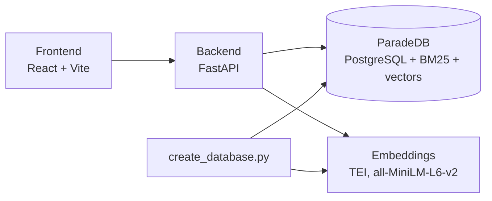

# PokéSearch

PokéSearch is a search engine for the Kanto Pokédex. Trainers can find a Pokémon, a move or an ability from a partial or misspelled name, or by describing what they are looking for, and narrow the results with type and stat filters.

## To run the app

Requirements: Docker, Conda (or Python 3.12) and Node.js 20.19+.

0. Configuration (no credentials, just ports)

```sh
cp .env.example .env
```

1. Database and embeddings service (first start downloads the model)

```sh
docker compose up -d
```

2. Data

```sh
curl -fL https://biolevatestatics.blob.core.windows.net/biolevate-tech-assessments/pokedex/pokedex.json \
  --create-dirs -o backend/data/pokedex.json
```

3. Backend

```sh
cd backend
conda create -n backend_pokesearch python=3.12
conda activate backend_pokesearch
pip install -r requirements.txt
python create_database.py
uvicorn main:app --port 8000
```

4. Frontend (in another terminal, from the root of the project)

```sh
cd frontend
npm install
npm run dev
```

Tests (from backend/)

```sh
pytest
```

## Supported needs

- **Find something from a partial or misspelled name**: Name mode tolerates typos and incomplete names (`bulba`, `pikchu`).
- **Find and compare candidates from practical criteria**: type and stat filters, with the stats shown in each result (a fast Electric Pokémon).
- **Find moves or abilities without knowing their names**: Description mode searches what they do, including with synonyms (`put the opponent to sleep`).
- **Explore a strategy** (partly supported): Description mode finds a starting point, like the rain abilities, and the detail pages lead to the related Pokémon and moves. There is no search across categories: this was left out on purpose to keep each list clear (see the decisions below).

## Architecture



### Frontend

| Page | Content |
|---|---|
| `/search` | Search Pokémon, moves or abilities, with filters |
| `/pokemon?id=` | A Pokémon and its stats, moves and abilities |
| `/move?id=` | A move and the Pokémon that learn it |
| `/ability?id=` | An ability and the Pokémon that have it |

### Backend

| Route | Returns | Used by |
|---|---|---|
| `GET /search` | Results of a search, with its filters | `/search` results |
| `GET /filters` | Min and max of each stat | `/search` sliders |
| `GET /types` | All the types | `/search` type filter |
| `GET /pokemon/{id}` | A Pokémon with its moves and abilities | `/pokemon` page |
| `GET /move/{id}` | A move with the Pokémon that learn it | `/move` page |
| `GET /ability/{id}` | An ability with the Pokémon that have it | `/ability` page |

- `main.py`: routes, input validation, errors
- `query_database.py`: all the SQL
- `embeddings.py`: calls the embeddings service

### Data flow

**Loading** (`create_database.py`): check the data → create the tables → insert the data → compute the embeddings.

**Searching** (`GET /search`):
- **Name mode**: fuzzy match on names (typos, partial names).
- **Description mode**: keyword search (BM25) + meaning search (vectors), merged into one ranking.
- Filters apply in both modes.

## Decisions and trade-offs

### A database instead of the JSON file

With 429 entities, loading the JSON in memory would have been enough and simpler. I chose PostgreSQL with ParadeDB to think about scale: indexed queries instead of Python loops, and stateless API servers that can be duplicated. ParadeDB also brings BM25, vectors and SQL filters into a single engine, so every kind of search runs in one query. It costs more setup (Docker, a loading script) for a dataset that does not need it yet, but the same design would hold with a much larger Pokédex.

### The embedding model in its own service

The model runs in a separate container (Hugging Face Text Embeddings Inference) instead of inside the backend. The backend stays light (no PyTorch, one HTTP call), and the model can be scaled, moved to a GPU or replaced without touching the API. Running `sentence-transformers` directly in FastAPI would have been simpler, at the price of one more container and a network call per description search here, but it would couple the API to the model.

### One category at a time

The user chooses Pokémon, moves or abilities, and results are never mixed: lists stay easy to read, and there is no need to compare scores between different kinds of entities. The detail pages then link Pokémon, moves and abilities together. The downside is that a broad need like "a rain team" (challenge 4) takes several searches: the rain abilities first, then the Pokémon that have them.

### Two explicit search modes

The search bar has a Name / Description switch instead of guessing what the user means. Name is a fuzzy match on names (`pg_trgm`: typos, partial names), Description searches the description texts. The user has to pick a mode, but the behavior stays predictable and easy to explain, where searching both at once and showing two sections of results would have been more complex.

### Hybrid description search

BM25 finds the exact words ("sleep" in "Puts the target to sleep") but misses synonyms ("fall asleep"), while vectors find the meaning but always return the closest results, even for nonsense. Description search therefore runs both separately, so one never removes what the other finds, and merges their rankings with Reciprocal Rank Fusion, which uses ranks because the two scores are not comparable. A maximum vector distance (0.75), chosen by measuring relevant and unrelated queries, removes results that are too far. Both methods count the same, so BM25 can bring some noise when the query contains common words; weighting them would need an evaluation set to be tuned properly.

## Known limitations and next steps

- **Relevance is tested, not measured.** The tests check expected results for key queries, but there is no evaluation set to score the search as a whole. The next step is to build one: a list of queries with their expected results, scored with recall and MRR. It would show how BM25, vectors and the hybrid search compare, and help tune the weight of each method in the fusion. Today both count the same, so BM25 can push unrelated results up when the query contains common words.
- **Limited test coverage.** The backend has a few key tests (retrieval, invalid input, filters, relevance of the main queries) and the frontend has none. The next step is to measure coverage, test the remaining backend paths, and add component tests for the search page.
- **No pagination.** `/search` returns every matching result, which is fine for this dataset but not for a large one. The next step is a `limit` / `offset` (or cursor) parameter, with the frontend loading more results on demand.
- **The backend and frontend are not containerized.** Only the database and the embeddings run in Docker. Adding a Dockerfile for the backend (FastAPI with uvicorn) and the frontend (the Vite build served as static files) would start the whole app with `docker compose up`, and would let the backend run as several replicas behind a load balancer, since it keeps no state.

## Representative queries

| # | Search | Top results | What it shows |
|---|---|---|---|
| 1 | Pokémon, Name: `bulba` | bulbasaur | A partial name is enough (challenge 1). Typos work too: `pikchu` finds pikachu. |
| 2 | Pokémon, no text, type Electric, Speed ≥ 100 | raichu, voltorb, electrode, electabuzz, jolteon, zapdos | Filters alone answer a practical need, with the stats shown to compare candidates (challenge 2). |
| 3 | Moves, Description: `put the opponent to sleep` | sing, sleep-powder, hypnosis, lovely-kiss, spore | Finding moves by what they do, without knowing their names (challenge 3). |
| 4 | Moves, Description: `make the enemy fall asleep`, type Grass | sleep-powder, spore | Synonyms: no keyword matches "Puts the target to sleep", the vectors find it by meaning. |
| 5 | Abilities, Description: `rain` | swift-swim, hydration, rain-dish, dry-skin | A strategy starting point (challenge 4): opening swift-swim lists the Pokémon that have it (poliwag, psyduck, kabutops...). |

## Validation

- **Automated tests** (`pytest`, 13 tests): successful retrieval, invalid input (400, 404, 422), the filters, and the relevance of the queries above (partial names, typos, keywords, synonyms).
- **Data loading**: `create_database.py` checks the SHA-256 of `pokedex.json`, and the row counts were compared with the JSON (151 Pokémon, 164 moves, 114 abilities and all their relations).
- **Manual checks**: each challenge was tried in the interface, and the setup was tested from scratch (empty Docker, fresh install) following the steps of this README.

## Time spent

About 12 to 13 hours.

## AI disclosure

I used Claude Code (Anthropic) as a pair programmer to discuss design options, write the code step by step, check third-party syntax against the documentation (ParadeDB, TEI) and debug. Every technical choice was discussed before implementation, so the code matches what I had in mind, and I reviewed every change manually before committing to keep full control of the code. It let me go deeper into the challenge and build a more complete product in a reasonable time.

**Suggestions I changed or rejected**:
- It proposed a single `search_documents` table to rank Pokémon, moves and abilities together. I rejected it for one search per category, which is simpler and clearer for the user.
- For the Pokémon details route, it rebuilt the original JSON structure to avoid changing the frontend. I asked to return the database rows directly and adapt the frontend, since the database is now the source of truth.
- It wrote a generic function computing the slider bounds from a configuration. I replaced it with two plain SQL queries, easier to read.
- It recommended searching names and descriptions at once and showing two sections of results. I chose an explicit Name / Description switch.
